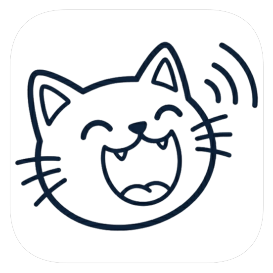
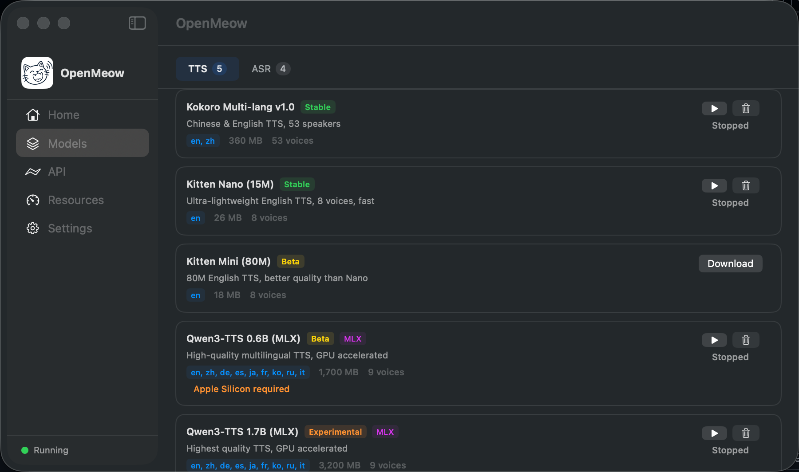

<p align="center">
  
</p>

<h1 align="center">OpenMeow</h1>

<p align="center">
  原生 macOS 菜单栏应用，提供本地 &amp; 云端 TTS/ASR 语音服务，兼容 OpenAI API。
</p>

<p align="center">
  <a href="LICENSE"></a>
  
  
  
  
</p>

<p align="center">
  <a href="#功能">功能</a> &bull;
  <a href="#安装">安装</a> &bull;
  <a href="#api-接口">API</a> &bull;
  <a href="#接入-openclaw">OpenClaw</a> &bull;
  <a href="#模型">模型</a> &bull;
  <a href="#构建">构建</a> &bull;
  <a href="README.md">English</a>
</p>

---

<p align="center">
  
</p>

## 功能

- **支持模型** - Kokoro TTS、Kitten TTS、Qwen3 TTS、MiMo v2 TTS、FireRedASR v2、Qwen3 ASR等本地或云端模型
- **菜单栏应用** — 在 macOS 后台静默运行（Apple Silicon）
- **OpenAI 兼容 API** — 可直接替换 `/v1/audio/speech` 和 `/v1/audio/transcriptions`
- **多引擎支持** — sherpa-onnx、speech-swift（Qwen3-TTS/ASR）
- **云端 TTS** — 支持 OpenAI 兼容服务、小米MiMo、阿里Qwen3等云端模型API接入
- **音频格式** — WAV、MP3、Opus（OGG/WebM）、PCM、FLAC、AAC
- **模型商店** — 内置模型注册表，一键下载管理
- **接入 OpenClaw** — 一行配置即可让 [OpenClaw](https://github.com/openclaw/openclaw) 获得本地语音能力
- **隐私优先** — 本地模型数据不离开设备；云端模型按需启用

## 系统要求

- macOS 15.0+
- Apple Silicon（M1/M2/M3/M4/M5）

## 安装

从 [Releases](../../releases) 下载最新的 `.dmg` 或 `.zip`，拖入"应用程序"文件夹即可使用。无需安装任何其他工具。

## API 接口

默认监听 `http://127.0.0.1:23333`。

| 端点 | 方法 | 说明 |
|------|------|------|
| `/v1/audio/speech` | POST | 文字转语音 |
| `/v1/audio/transcriptions` | POST | 语音转文字 |
| `/v1/models` | GET | 获取可用模型列表 |
| `/v1/voices` | GET | 获取可用语音列表 |
| `/health` | GET | 健康检查 |

### TTS 示例

```bash
curl -X POST http://127.0.0.1:23333/v1/audio/speech \
  -H "Content-Type: application/json" \
  -d '{"model": "kokoro-multi-lang-v1_0", "input": "你好，来自 OpenMeow！", "voice": "af_heart"}' \
  --output speech.mp3
```

### ASR 示例

```bash
curl -X POST http://127.0.0.1:23333/v1/audio/transcriptions \
  -F "file=@audio.wav" \
  -F "model=whisper-large-v3-turbo"
```

## 接入 OpenClaw

OpenMeow 的 API 与 OpenAI 完全兼容，[OpenClaw](https://github.com/openclaw/openclaw) 可以直接将其作为本地语音后端，无需任何云服务。

**TTS** — 添加到 OpenClaw 配置中：

```jsonc
"messages": {
  "tts": {
    "auto": "always",
    "provider": "openai",
    "providers": {
      "openai": {
        "apiKey": "dummy-key",
        "baseUrl": "http://127.0.0.1:23333/v1",
        "model": "qwen3-tts-1.7b-mlx",
        "voice": "Vivian"
      }
    },
    "timeoutMs": 60000
  }
}
```

**ASR** — 添加到 `tools.media.audio`：

```jsonc
"tools": {
  "media": {
    "audio": {
      "enabled": true,
      "models": [
        {
          "type": "cli",
          "command": "/bin/sh",
          "args": [
            "-c",
            "curl -s http://127.0.0.1:23333/v1/audio/transcriptions -F file=@{{MediaPath}} -F model=qwen3-asr-0.6b-mlx | jq -r .text"
          ],
          "timeoutSeconds": 60
        }
      ]
    }
  }
}
```

## 模型

### 语音合成（TTS）— 本地

| 模型 | 大小 | 语言 |
|------|------|------|
| Kokoro Multi-lang v1.0 | 360 MB | 中文、英文 |
| Kitten Nano v0.1 | 26 MB | 英文 |
| Kitten Mini v0.1 | 18 MB | 英文 |
| Qwen3-TTS 0.6B (MLX) | 1.7 GB | 多语言 |
| Qwen3-TTS 1.7B (MLX) | 3.2 GB | 多语言 |

### 语音合成（TTS）— 云端

| 模型 | 服务商 | 音色 | 语言 |
|------|--------|------|------|
| OpenAI TTS（云端）| OpenAI / 兼容服务 | 6 个 | 14 种语言 |
| MiMo TTS v2（云端）| 小米 MiMo | 3 个 | 中文、英文 |
| Qwen3 TTS Flash（云端）| 阿里云 DashScope | 44 个 | 10 种语言（含中文方言）|

### 语音识别（ASR）

| 模型 | 大小 | 语言 |
|------|------|------|
| FireRedASR v2 | 200 MB | 中文 + 20 种方言 |
| Qwen3-ASR 0.6B (MLX) | 680 MB | 30+ 种语言 |
| Whisper Large v3 Turbo | 600 MB | 92+ 种语言 |
| Whisper Base | 150 MB | 99 种语言 |

## 构建

```bash
# 1. 克隆仓库
git clone https://github.com/user/openmeow.git
cd openmeow

# 2. 下载框架依赖
Scripts/download-sherpa-onnx.sh
Scripts/download-opus.sh
Scripts/download-lame.sh

# 3. 用 Xcode 打开并构建
open openmeow/openmeow.xcodeproj
```

> 框架文件（sherpa-onnx、opus、lame）因体积较大未包含在仓库中，构建脚本会自动下载编译。

## 许可证

[MIT](LICENSE)

### 第三方组件

| 组件 | 许可证 | 说明 |
|------|--------|------|
| [sherpa-onnx](https://github.com/k2-fsa/sherpa-onnx) | Apache-2.0 | 端侧语音引擎（TTS/ASR）|
| [speech-swift](https://github.com/soniqo/speech-swift) | Apache-2.0 | Qwen3-TTS/ASR（MLX 加速）|
| [LAME](https://lame.sourceforge.io/) | LGPL-2.0 | MP3 编码器（动态链接）|

LAME 是唯一的 LGPL 组件，以动态链接方式（`libmp3lame.dylib`）使用。你可以用自己编译的版本替换。详见 [THIRD-PARTY-LICENSES](THIRD-PARTY-LICENSES)。
